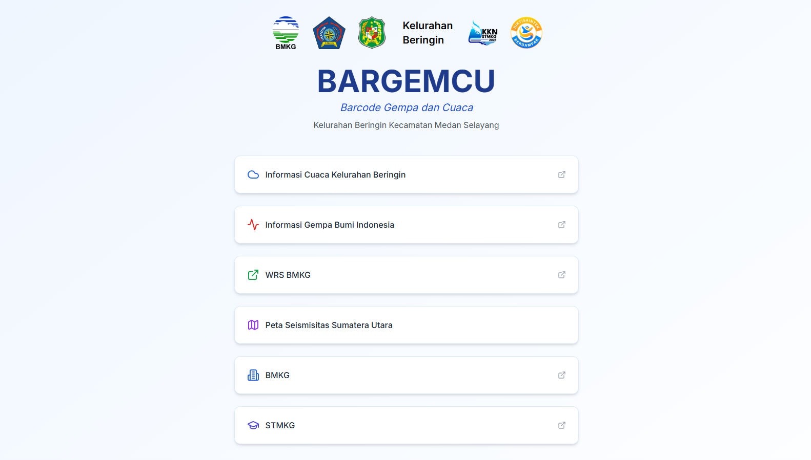

# BARGEMCU - Barcode Gempa dan Cuaca



## 📋 Deskripsi

BARGEMCU (Barcode Gempa dan Cuaca) adalah portal informasi yang menyediakan akses mudah ke data gempa bumi dan prakiraan cuaca terkini untuk Kelurahan Beringin, Kecamatan Medan Selayang. Aplikasi ini dikembangkan oleh Unit 1 Kuliah Kerja Nyata STMKG Angkatan VII Tahun 2025 sebagai bagian dari program pengabdian masyarakat.

### 🌟 Fitur Utama

- **Informasi Cuaca Terkini**: Akses langsung ke prakiraan cuaca Kelurahan Beringin dari BMKG
- **Data Gempa Bumi**: Informasi gempa bumi terbaru di Indonesia
- **Peta Seismisitas**: Visualisasi aktivitas gempa bumi di Provinsi Sumatera Utara tahun 2000-2025
- **Berbagi Informasi**: Kemudahan berbagi informasi melalui media sosial dan platform lainnya

## 🔗 Tautan Penting

- **Website**: [bargemcu.netlify.app](https://bargemcu.netlify.app)
- **BMKG**: [bmkg.go.id](https://bmkg.go.id)
- **STMKG**: [stmkg.ac.id](https://stmkg.ac.id)
- **Kota Medan**: [portal.medan.go.id](https://portal.medan.go.id)
- **Instagram Kelurahan Beringin**: [@kelurahan_beringin](https://www.instagram.com/kelurahan_beringin/)
- **Instagram KKN STMKG Unit 1**: [@kknstmkg.unit1](https://www.instagram.com/kknstmkg.unit1/)

## 🛠️ Teknologi

Aplikasi ini dibangun menggunakan teknologi modern:

- **Framework**: [Next.js](https://nextjs.org/) - Framework React dengan fitur SSR dan SSG
- **Styling**: [Tailwind CSS](https://tailwindcss.com/) - Framework CSS utility-first
- **Icons**: [Lucide React](https://lucide.dev/) - Kumpulan ikon minimalis dan konsisten
- **Optimasi Gambar**: WebP format dan optimasi otomatis Next.js
- **SEO**: Metadata teroptimasi, Structured Data (JSON-LD), Sitemap, dan Robots.txt

## 📱 Halaman dan Fitur

### 🏠 Halaman Utama

Halaman utama menyediakan akses cepat ke:

1. **Informasi Cuaca** - Prakiraan cuaca Kelurahan Beringin
2. **Informasi Gempa** - Data gempa bumi terbaru di Indonesia
3. **WRS BMKG** - Sistem Peringatan Dini Tsunami
4. **Peta Seismisitas** - Visualisasi aktivitas gempa di Sumatera Utara
5. **Tautan BMKG dan STMKG** - Akses ke website resmi
6. **Fitur Berbagi** - Tombol untuk berbagi ke Facebook, LinkedIn, WhatsApp, dan salin ke clipboard

### 🗺️ Halaman Peta Seismisitas

Halaman ini menampilkan:

1. **Peta Seismisitas** - Visualisasi aktivitas gempa di Sumatera Utara tahun 2000-2025
2. **Arah Mata Angin** - Kompas untuk orientasi peta
3. **Keterangan Peta** - Dokumen PDF yang menjelaskan tentang peta seismisitas

## 🚀 Pengembangan

### Prasyarat

- Node.js 16.x atau lebih tinggi
- npm atau pnpm

### Instalasi

```bash
# Clone repository
git clone https://github.com/username/bargemcu.git

# Pindah ke direktori proyek
cd bargemcu

# Instal dependensi
npm install
# atau
pnpm install

# Jalankan server pengembangan
npm run dev
# atau
pnpm dev
```

### Build

```bash
# Build untuk produksi
npm run build
# atau
pnpm build

# Jalankan build lokal
npm run start
# atau
pnpm start
```

## 🤝 Kontribusi

Kontribusi untuk meningkatkan BARGEMCU sangat diapresiasi. Silakan ikuti langkah-langkah berikut:

1. Fork repository
2. Buat branch fitur (`git checkout -b feature/AmazingFeature`)
3. Commit perubahan (`git commit -m 'Add some AmazingFeature'`)
4. Push ke branch (`git push origin feature/AmazingFeature`)
5. Buka Pull Request

## 📄 Lisensi

Hak Cipta © 2025 KKN STMKG Unit 1. Semua hak dilindungi.

## 👥 Tim Pengembang

- KKN STMKG Unit 1 Angkatan VII Tahun 2025
- Dibuat dalam kolaborasi dengan BMKG, STMKG, dan Kelurahan Beringin

## 📞 Kontak

Untuk pertanyaan dan informasi lebih lanjut, silakan hubungi melalui:

- Instagram: [@kknstmkg.unit1](https://www.instagram.com/kknstmkg.unit1/)